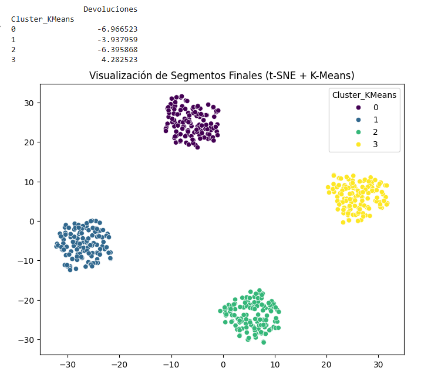

# EXAMENMODULO7RETAIL
Entrega Examen Modulo 7

## 📌 Descripción del Proyecto
Este proyecto fue desarrollado para **Retail Insights S.A.**, una consultora de inteligencia de negocios. El objetivo principal es transformar datos brutos de clientes en segmentos de comportamiento accionables mediante **Machine Learning No Supervisado**.

A través de técnicas de reducción de dimensionalidad y clusterización, logramos identificar grupos ocultos de consumidores, permitiendo que el equipo de marketing pase de estrategias masivas a campañas de personalización quirúrgica.

## 🚀 Características Técnicas
- **Preprocesamiento Avanzado:** Limpieza de outliers (IQR) y normalización de datos.
- **Reducción de Dimensionalidad:** Comparativa entre PCA y t-SNE para visualización en 2D.
- **Clustering Multialgoritmo:** Implementación y evaluación de:
  - K-Means
  - DBSCAN (para detección de ruido)
  - Agrupamiento Jerárquico (Dendrogramas)
- **Validación de Modelos:** Análisis de Coeficiente de Silueta y Método del Codo.

## 📊 Resultados Principales
El modelo final utiliza un valor de **K=4**, logrando un **Coeficiente de Silueta de 0.64**, lo que garantiza una segmentación matemática robusta y consistente.

### Perfiles Identificados:
1. **Fiel de Bajo Costo:** Alta recurrencia, pocas devoluciones, gasto moderado.
2. **Nuevo Prospecto:** Clientes en fase de exploración con baja antigüedad.
3. **Cazador de Ofertas VIP:** Máximo gasto y frecuencia, optimizando el valor por compra.
4. **Premium Crítico:** Clientes de alto valor con alta tasa de fricción (devoluciones).

## 📊 Visualización de Clusters

## 📁 Estructura del Repositorio
* `Retail Insights Modulo 7.csv`: Dataset original con métricas de clientes.
* `Examen_Modulo_7.ipynb`: Notebook con el pipeline completo de análisis y modelado.
* `PNG.`: Carpeta con los gráficos de t-SNE, Método del Codo y Silueta.
* `Informe_Final.pdf`: Documento con las justificaciones técnicas y recomendaciones comerciales.

* 

